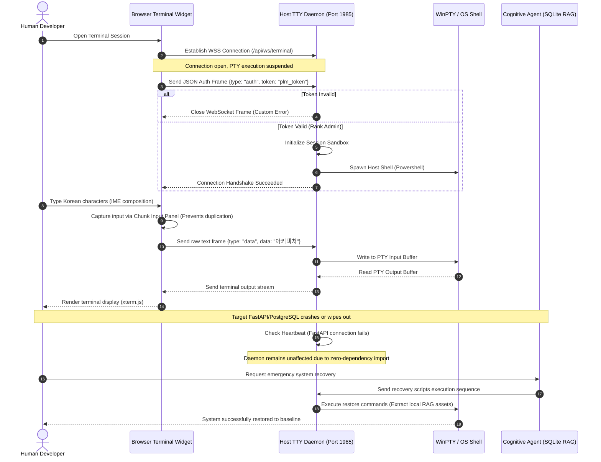

# The Sovereign Agent Architecture

> **Zero-Dependency PTY Bridge & Portable RAG Header for Crash-Immunity Coding Agents**

This specification defines the **Sovereign Agent Architecture**, a self-hosted, offline-first design pattern that decouples the AI agent's control infrastructure from the target business applications. 

By enforcing strict process boundary isolation and lightweight portable knowledge stores, this architecture guarantees that the agent remains operational even during severe application-level crashes or network disconnections.

---

## 1. Core Architectural Pillars

```
+-----------------------------------------------------------------------+
|                       SOVEREIGN AGENT ARCHITECTURE                     |
+-----------------------------------------------------------------------+
|                                                                       |
|  [ Agent Infra Layer ]                                                |
|  +------------------+      (WSS Port 1985)     +-------------------+  |
|  |  Cognitive Agent | <======================> |  Zero-Dep Daemon  |  |
|  |  (Offline-First) |   2-Step Handshake Auth  |  (WinPTY Bridge)  |  |
|  +------------------+                          +-------------------+  |
|           ^                                              |            |
|           | (Fast Local I/O)                             | (Spawn)    |
|           v                                              v            |
|  +------------------+                          +-------------------+  |
|  | SQLite RAG DB    |                          | Native Host Shell |  |
|  | (agent_rag.db)   |                          | (Powershell/Bash) |  |
|  +------------------+                          +-------------------+  |
|                                                          |            |
|                                                          | (Interacts)|
|                                                          v            |
|  [ Business Service Layer ]                    +-------------------+  |
|  +-------------------------------------------+ |  Target App Logic |  |
|  |  WBS Gantt / API / Database / Containers   | |  (Vue3 / FastAPI) |  |
|  +-------------------------------------------+ +-------------------+  |
|                                                                       |
+-----------------------------------------------------------------------+
```

### Pillar 1. Zero-Dependency PTY Bridge (Crash Immunity)
Traditional agents execute shell commands via tightly-coupled backend subprocesses. If the backend server encounters a database deadlock or memory overflow, the terminal bridge crashes, severing the developer's control.
*   **Decoupled Host Daemon**: A standalone PTY bridge daemon (`run_terminal_daemon.py`) runs independently on the host environment (e.g., port 1985).
*   **Zero Imports**: The daemon strictly imports zero business-logic dependencies, zero database models, and zero framework libraries.
*   **Thread-Safe Cleanup**: Active subprocess termination and WinPTY pipes cleanup are handled asynchronously outside the main event loop, preventing asyncio blockade during terminal termination.
*   **2-Step Handshake**: Avoids exposed token query parameters by utilizing WebSocket immediate frame-one payload validation (`{ "type": "auth", "token": "..." }`).

### Pillar 2. Portable Brain Header (SQLite RAG)
Instead of relying on heavy cloud-based Vector Databases (e.g. Pinecone, Milvus), the agent's memory is encapsulated in a single, local SQLite database file utilizing the native FTS5 extension.
*   **Zero Network Overhead**: Context retrieval and history tracing execute as direct local file I/O operations.
*   **Instant Portability**: Copying a single `.db` file instantly migrates the agent's long-term memory, past commit diffs, and context to any isolated machine.
*   **Incremental Syncing**: Track code evolutionary changes by parsing Git logs into structured tables for high-density semantic searches.

### Pillar 3. CJK IME Chunk Input UX (Composition Fix)
Web-based terminal emulators (like xterm.js) suffer from a critical CJK (Chinese, Japanese, Korean) Input Method Editor (IME) bug where combined letters are duplicated or printed out-of-order due to conflicting composition events.
*   **Composition Sandbox**: Deactivates native browser CJK composition event handlers inside the core xterm.js container.
*   **Chunk Input Panel**: Introduces a dedicated, decoupled input panel for buffer queuing.
*   **Single-Stream Injection**: Validated text chunks are injected as a single raw `onData` stream directly to the PTY, ensuring zero character duplication.

---

## 2. Sequence Diagram: Lifecycle & Control Flow

The sequence diagram below demonstrates the authorization, execution, and self-preservation lifecycle of the Sovereign Agent Architecture:



---

## 3. Deployment & Setup Guidelines

### Step 1: Run the Standalone Daemon
Execute the PTY daemon directly on the host system to bypass container sandbox limitations.
```bash
# zero-dependency daemon execution
python backend/run_terminal_daemon.py --port 1985 --host 127.0.0.1
```

### Step 2: Establish Frontend Connection
Initialize the web terminal component to communicate via the 2-step authentication protocol.
```typescript
const ws = new WebSocket("ws://127.0.0.1:1985/api/ws/terminal");

ws.onopen = () => {
  // Step 1: Send Immediate Authentication Frame
  ws.send(JSON.stringify({
    type: "auth",
    token: "YOUR_ADMIN_TOKEN"
  }));
};
```

---

## 4. Architectural Advantages

1.  **Isolation against Cascade Failures**: The control plane (Terminal/Agent) never shares DB connections or runtime environments with the application plane.
2.  **Ultra-lightweight footprint**: The entire core logic (excluding node_modules/venv) fits within **~2 MB**, allowing seamless ZIP snapshot backups.
3.  **Self-healing capabilities**: The local RAG database keeps track of state evolutionary history, enabling offline recovery without any central cloud dependency.

---

## License

This architecture specification is open for the developer ecosystem under the **MIT License**. Decouple your agent, secure your host, and retain absolute sovereignty.
